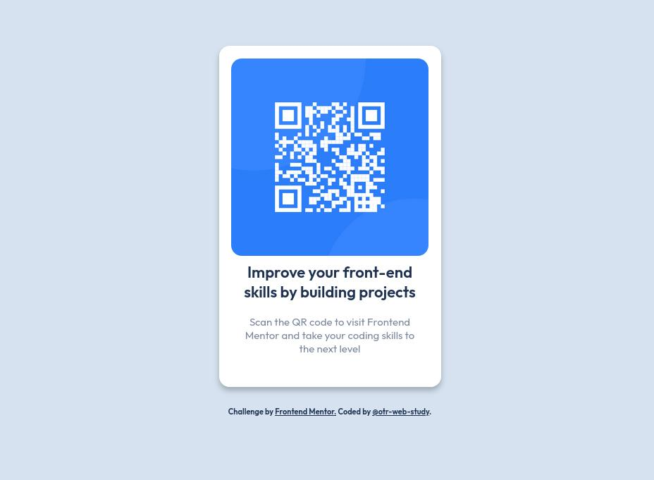

# Frontend Mentor - QR code component solution

This is a solution to the [QR code component challenge on Frontend Mentor](https://www.frontendmentor.io/challenges/qr-code-component-iux_sIO_H). Frontend Mentor challenges help you improve your coding skills by building realistic projects.

## Overview

### Screenshot

### Links

- [Solution] (https://www.frontendmentor.io/solutions/qrcodecomponent-g_Ms3SXDO8)
- [Live Site] (https://otr-web-study.github.io/fm-qr-code-component/)

## My process

### Built with

- Semantic HTML5 markup
- CSS custom properties

- Frontend Mentor - [@otr-web-study](https://www.frontendmentor.io/profile/otr-web-study)
